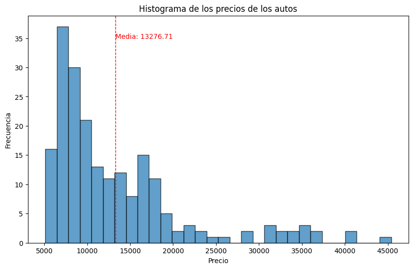
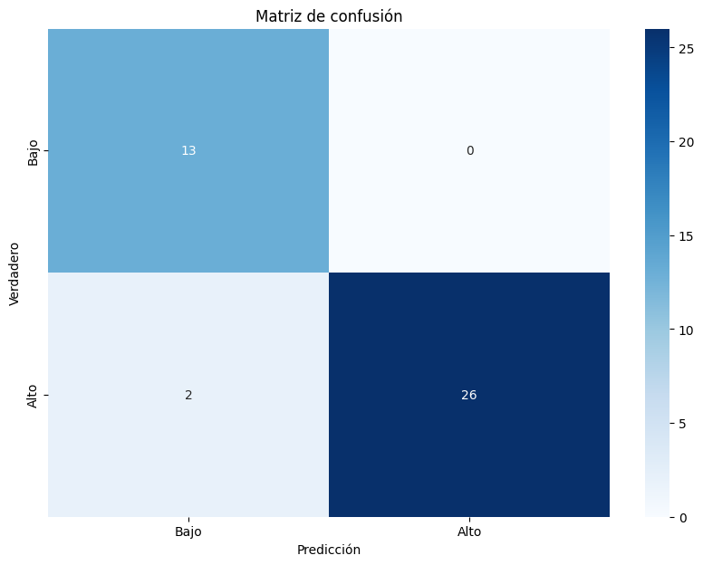

# Proyecto_Cars
Proyecto Integrador M6 - Machine Learning SoyHenry

Se ha realizado un analísis del mercado automotor del dataset proporcionado del cual se implementó:

* Un modelo de clasificación con aprendizaje supervisado que permita clasificar el precio de los vehículos en baratos y caros usando la mediana de los precios como punto de corte, utilizando los datos que se han puesto a su disposición.

* Un modelo de regresión con aprendizaje supervisado que permita predecir el precio final de los vehículos, utilizando los datos que se han puesto a su disposición.

Del analisis exploratorio obtuvimos el siguiente histograma que muestra la distribución de precios de autos del mercado:

De un primer analisis se detecto las principales variables que influyen sobre el precio y se implementaron para la clasificación: Arboles de decisiones, y para la Regresión tres modelos (Regresión Lineal, Arboles de decisión, XGBoost) y los comparamos.

## Clasificación de Autos en Categorías de Precio (Bajo y Alto)
#### Matriz de Confusión:

La matriz de confusión indica que el modelo clasificador ha identificado correctamente 13 autos como "Alto" y 26 autos como "Bajo".
Hubo 2 casos de autos clasificados erróneamente como "Alto" cuando deberían haber sido "Bajo".

#### Informe de Clasificación:

##### Precisión (Precision):
Para la clase "Alto" es 0.87, lo que significa que el 87% de las veces que el modelo predijo "Alto", estaba en lo correcto.
Para la clase "Bajo" es 1.00, lo que indica una precisión perfecta para esta clase.
##### Exhaustividad (Recall):
Para la clase "Alto" es 1.00, lo que significa que el modelo identificó correctamente todos los casos de "Alto".
Para la clase "Bajo" es 0.93, lo que indica que el modelo identificó correctamente el 93% de los casos de "Bajo".
##### F1-Score:
Para la clase "Alto" es 0.93, lo que refleja un buen equilibrio entre precisión y exhaustividad.
Para la clase "Bajo" es 0.96, lo que indica un excelente equilibrio entre precisión y exhaustividad.
##### Exactitud (Accuracy):
El modelo tiene una exactitud del 95%, lo que significa que el 95% de las predicciones fueron correctas.
##### Promedio Macro y Promedio Ponderado:
Ambos promedios (macro y ponderado) son altos, indicando un buen rendimiento general del modelo en ambas clases.

### Comparación de Modelos de Regresión

#### Modelo de Regresión Lineal:

El modelo de Regresión Lineal muestra un error cuadrático medio relativamente alto y un R² de 0.823, lo que indica que el modelo explica el 82.3% de la variabilidad en los precios. Sin embargo, tiene un error absoluto medio de 2,713.05, lo que sugiere que las predicciones pueden ser inexactas en un promedio de 2,713 unidades monetarias.

#### Modelo XGBoost:

El modelo XGBoost tiene el mejor rendimiento entre los modelos evaluados. Tiene el menor error cuadrático medio (MSE) y el menor error absoluto medio (MAE), lo que indica predicciones más precisas. Con un R² de 0.938, el modelo explica el 93.8% de la variabilidad en los precios.

#### Modelo de Árbol de Decisión:

El modelo de Árbol de Decisión también muestra un buen rendimiento con un MSE de 7,515,757 y un MAE de 1,836.94. Su R² de 0.905 indica que el modelo explica el 90.5% de la variabilidad en los precios, lo que es un rendimiento sólido, pero no tan bueno como el modelo XGBoost.

### Conclusiones Generales
#### Clasificación:

El modelo clasificador ha mostrado un rendimiento excelente en la clasificación de autos en categorías de precio bajo y alto, con una precisión, exhaustividad y F1-score muy altos, especialmente para la clase "Bajo".
#### Regresión:

De los modelos de regresión evaluados, el modelo XGBoost ha mostrado el mejor rendimiento, con el menor error y la mayor capacidad explicativa (R²).
El modelo de Regresión Lineal, aunque útil, no es tan preciso como los modelos más complejos como XGBoost y el Árbol de Decisión.
El modelo de Árbol de Decisión es una opción sólida, pero aún así, XGBoost ofrece mejores resultados.
#### Recomendaciones:

Para predicciones de precio, se recomienda utilizar el modelo XGBoost debido a su alta precisión y bajo error.
Para tareas de clasificación, el modelo actual es muy efectivo, con una exactitud del 95%. Sin embargo, si se busca mejorar la precisión en la clase "Alto", se pueden explorar técnicas adicionales de ajuste fino del modelo.
Esta evaluación proporciona una base sólida para la toma de decisiones sobre qué modelo utilizar en función de las necesidades específicas del análisis de mercado para la automotriz.
